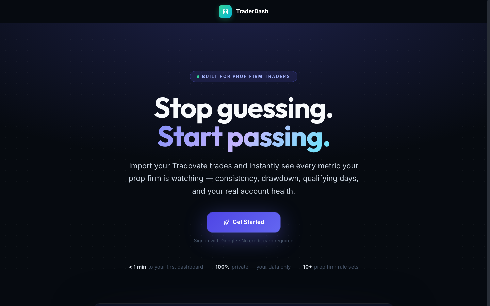
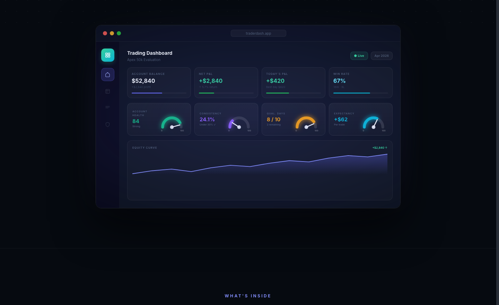
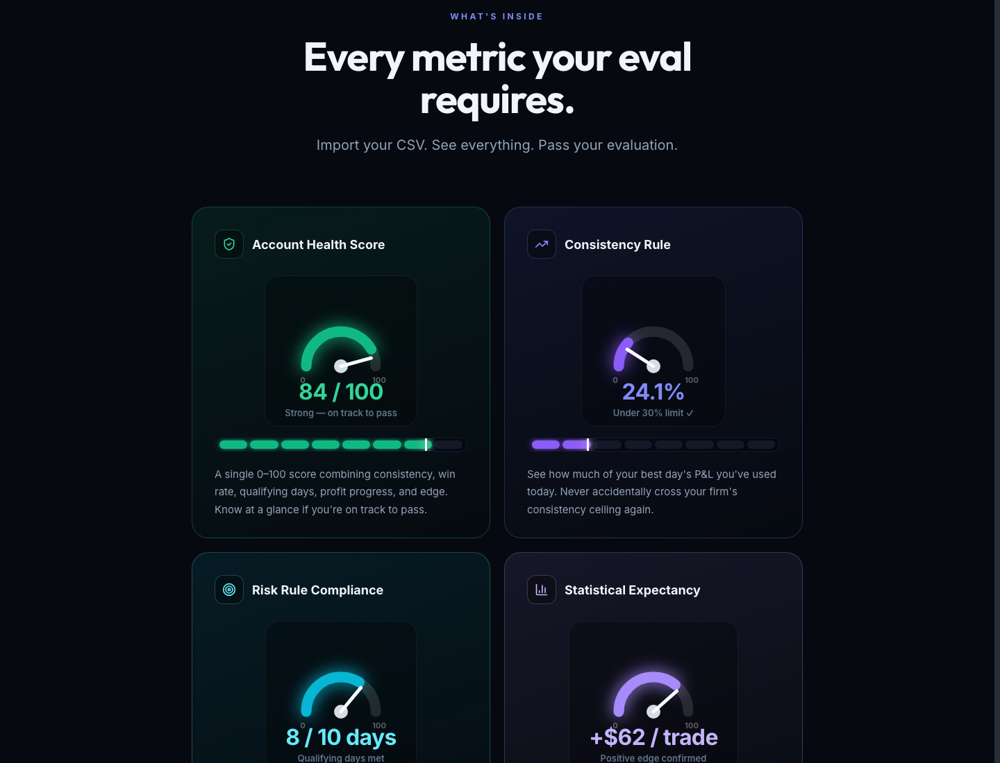
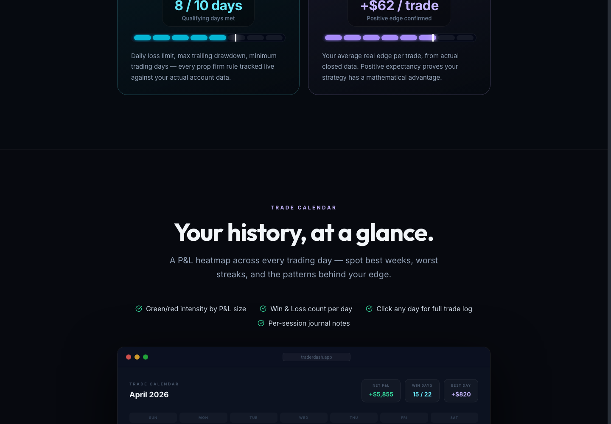

# TraderDash — Prop Firm Performance Tracker

> Import your Tradovate trades. See every metric your prop firm is watching. Pass your evaluation.



---

## Dashboard Preview

The live dashboard shows account balance, Net P&L, today's P&L, win rate, and four prop-firm-specific health dials — all from your imported Tradovate data.



---

## Key Metrics

Every metric your evaluation requires, with live gauges and real-time data from your CSV imports.



| Metric | What it tracks |
|---|---|
| **Account Health Score** | 0–100 score combining consistency, win rate, qualifying days, profit progress, and edge |
| **Consistency Rule** | Best day's P&L as a % of total profit — flags before you breach the ceiling |
| **Risk Rule Compliance** | Daily loss limit, trailing drawdown, and qualifying days tracked live |
| **Statistical Expectancy** | Average real edge per trade from actual closed data |

---

## Trade Calendar

A P&L heatmap across every trading day — spot best weeks, worst streaks, and the patterns behind your edge.



---

## Features

- **Tradovate CSV import** — Fills, Performance, Cash, and TopstepX bundles
- **EOD trailing drawdown floor** — Tracks your peak end-of-day balance; hard floor shown in the balance card, never resets down
- **Consistency rule live** — Best day % of total profit vs. your firm's ceiling
- **Qualifying days tracker** — Counts days meeting your minimum daily profit requirement
- **Account Health Score** — Single 0–100 composite score for your eval status
- **Trade Calendar** — Day-by-day P&L heatmap with W/L badges
- **Equity curve** — Running balance chart across your full history
- **Multi-account support** — Switch between multiple Tradovate accounts
- **Prop firm presets** — Apex, TopStep, MyFundedFutures, Tradeify, LucidFlex pre-configured
- **Tradovate sync sidecar** — Browser-assisted automated report downloads

---

## Stack

- React 19 · TypeScript · Vite
- Tailwind CSS · Recharts
- Supabase (auth + storage)
- Playwright (sync sidecar)

---

## Getting Started

```bash
npm install
npm run dev
```

App runs at `http://127.0.0.1:5173`

```bash
npm run build       # production build
npm run preview     # preview production build
npm run lint
npm run sync-helper
```

---

## Project Structure

```
src/
├── App.tsx
├── context/
│   ├── DataContext.tsx            # account state, imports, rules, merge logic
│   └── SyncContext.tsx            # sync status and trigger flow
├── components/
│   ├── Dashboard.tsx              # main performance dashboard
│   ├── DashboardComponents.tsx    # MetricCard, FuelGauge, StoryMeter, charts
│   ├── SafetySettings.tsx         # prop safety rules editor
│   ├── SafetyTracker.tsx          # live compliance status cards
│   ├── TradeCalendar.tsx          # day-by-day P&L heatmap
│   ├── LandingPage.tsx            # public marketing page
│   └── DataManager.tsx            # imports and account cleanup
└── utils/
    ├── csvParser.ts               # Tradovate CSV parsing
    └── tradingDay.ts              # trading day boundary logic
```

---

## Tradovate Sync Sidecar

A separate local automation package under `sync-sidecar/` that uses a persistent browser profile and Playwright to download Tradovate reports automatically.

```bash
cd sync-sidecar
npm install
cp ../.env.sync.example .env.sync.local

npm run status
npm run sync
```

See [`sync-sidecar/README.md`](sync-sidecar/README.md) and [`docs/tradovate-sync-foundation.md`](docs/tradovate-sync-foundation.md).

---

## Sync Helper

A lightweight helper server under `sync-helper/`:

```bash
npm run sync-helper
# Listens on http://127.0.0.1:43128
```

---

## Notes

- App state is persisted in `localStorage`
- Sample CSV files are included under `public/` for local testing
- Do not commit real Tradovate credentials to the repo
